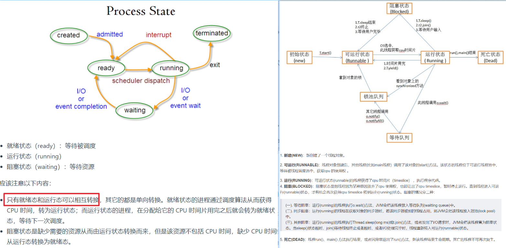
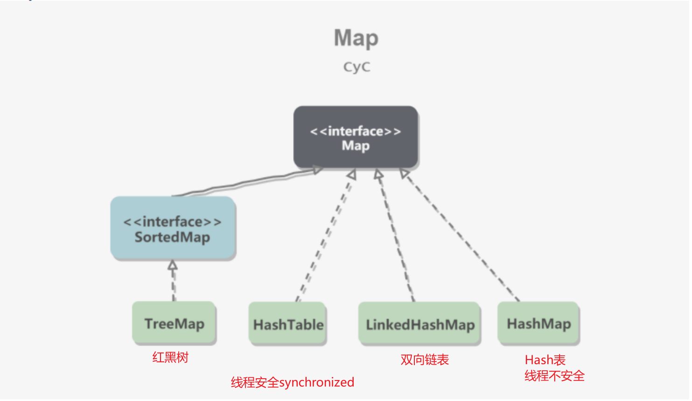

# CSNotes -----------------

# 操作系统

## 进程通信

进程间通信（张三同学）超级详细，有对比：https://www.nowcoder.com/discuss/462678?type=all&order=time&pos=&page=1&channel=-1&source_id=search_all_nctrack

- 匿名管道：通过匿名管道使2个进程通信，比如| grep就是。但是匿名通常是单向的，字节流的。
- 有名管道：可以是多方向的，比如linux的pipe，但是这个是阻塞的。
- 消息队列：生产者与消费者模型，生产者生产完了，放入队列直接走掉。这个可以是自定义结构的数据，==但传输大小受限制，存在内核与用户态数据拷贝的开销。==
- 共享内存：两个进程共享内存来通信，不存在开销问题，但会出现不同步的问题。
- 原语操作：用PV操作来控制对共享内存的互斥操作，解决冲突的问题。
- Socket：本地、跨网段进行Socket通信，可以实现TCP、UDP的通信。

## 进程与线程状态

[进程状态的切换](http://www.cyc2018.xyz/计算机基础/操作系统基础/计算机操作系统 - 进程管理.html#进程状态的切换)

线程的5种状态详解：https://blog.csdn.net/xingjing1226/article/details/81977129

1. **新建(NEW)**：新创建了一个线程对象。

2. **可运行(RUNNABLE)**：线程对象创建后，其他线程(比如main线程）调用了该对象的start()方法。该状态的线程位于可运行线程池中，等待被线程调度选中，获取cpu 的使用权 。

3. **运行(RUNNING)**：可运行状态(runnable)的线程获得了cpu 时间片（timeslice） ，执行程序代码。

4. **阻塞(BLOCKED)**：阻塞状态是指线程因为某种原因放弃了cpu 使用权，也即让出了cpu timeslice，暂时停止运行。直到线程进入可运行(runnable)状态，才有机会再次获得cpu timeslice 转到运行(running)状态。阻塞的情况分三种： 

> (一). 等待阻塞：运行(running)的线程执行o.wait()方法，JVM会把该线程放入等待队列(waitting queue)中。
> (二). 同步阻塞：运行(running)的线程在获取对象的同步锁时，若该同步锁被别的线程占用，则JVM会把该线程放入锁池(lock pool)中。
> (三). 其他阻塞：运行(running)的线程执行Thread.sleep(long ms)或t.join()方法，或者发出了I/O请求时，JVM会把该线程置为阻塞状态。当sleep()状态超时、join()等待线程终止或者超时、或者I/O处理完毕时，线程重新转入可运行(runnable)状态。

5. **死亡(DEAD)**：线程run()、main() 方法执行结束，或者因异常退出了run()方法，则该线程结束生命周期。死亡的线程不可再次复生。

==挂起、睡眠、阻塞、等待==

调用 Thread.sleep() 方法使线程进入限期等待状态时，常常用“使一个线程睡眠”进行描述。调用 Object.wait() 方法使线程进入限期等待或者无限期等待时，常常用“挂起一个线程”进行描述。睡眠和挂起是用来描述行为，而阻塞和等待用来描述状态。

# Socket？？

一个输入操作通常包括两个阶段：

- 等待数据准备好
- 从内核向进程复制数据

对于一个套接字上的输入操作，第一步通常涉及等待数据从网络中到达。当所等待数据到达时，它被复制到内核中的某个缓冲区。第二步就是把数据从内核缓冲区复制到应用进程缓冲区。

## 一、IO模型

sun总结：一般分为同步阻塞，同步非阻塞，**IO多路复用**，信号驱动 I/O、异步IO。效率较高的时IO多路复用，和异步IO。

## 二、I/O复用？？

就是 select / poll / epoll等等

# Java部分

## Java基础

### 反射？？

## Java容器

### 一、概览

### 二 容器设计模式？？

### 三 源码分析？？

其他的结构没有看。

#### HashMap

#### ConCurrentHashMap

## Java并发

### 11 线程安全

####  不可变

#### 非阻塞同步（乐观锁）

C：ABA问题：CAS识别不出，变量被从A-》B->A的过程，以为他没有变化。

用：AtomicStampedReference解决！！！

#### 无同步方案

[#](http://www.cyc2018.xyz/Java/Java 并发.html#_1-栈封闭)1. 栈封闭

局部变量存储在虚拟机栈中，属于线程私有的。

sun：如果用局部变量可以让变量无需同步，就别同步了。局部变量存在 虚拟机栈里面。

[#](http://www.cyc2018.xyz/Java/Java 并发.html#_2-线程本地存储-thread-local-storage)2. 线程本地存储（Thread Local Storage）？？？？

### 12 锁优化

#### 锁粗化

#### 轻量级锁？？

JDK 1.6 引入了偏向锁和轻量级锁，从而让锁拥有了四个状态：无锁状态（unlocked）、偏向锁状态（biasble）、轻量级锁状态（lightweight locked）和重量级锁状态（inflated）。

#### 偏向锁？？

## Java虚拟机

1. 

### 一 运行时数据区

应用类型

1. 强
2. 弱：内存不够时，就被回收
3. 软：下次GC就被回收
4. 虚：被回收时，系统会收到通知。

垃圾收集算法：

1. 标记清除
2. 标记整理
3. 标称清除整理压缩
4. 标记复制
5. 分代收集理论。

### 二 垃圾收集器

### 三

### 四 类加载机制

类的初始化时机：

1. 主动引用（5种）一定会执行初始化
2. 被动应用（），一定不会执行初始化。

#### 类的加载时机：

## Java IO

### Java NIO？？

sun：自己的总结

# 构建工具	

- 

